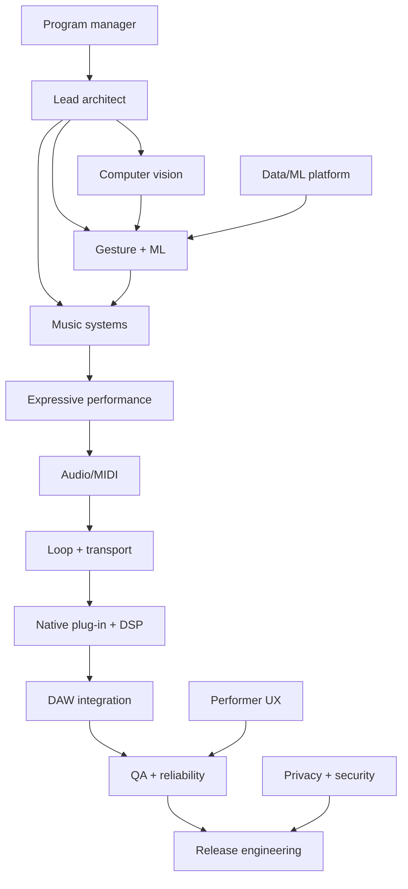

# AI/ML team operating model

The team is a set of focused agents, not a collection of agents editing one shared folder. `agents/registry.yaml` is the source of truth for ownership and dependencies.

## Coordination protocol

1. The program manager selects one milestone and activates only the roles needed for it.
2. Each specialist works in a branch/worktree and delivers code, tests, and a short handoff note.
3. The lead architect integrates contract changes in dependency order.
4. QA runs the full suite plus hardware smoke tests when hardware is available.
5. Release engineering packages only from a tagged, tested commit.

## Workstream graph

The live runtime never calls an AI agent. Agents accelerate design, implementation, testing, data analysis, and release operations around the product.
