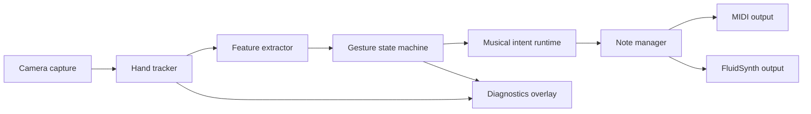

# System architecture



## Boundaries

### Capture and tracking

`camera` owns frames and shutdown. `tracking` owns MediaPipe integration and converts vendor-specific results into `HandObservation`. No downstream module imports MediaPipe types.

### Features and gestures

`gestures.features` converts observations into normalized geometry and motion. `gestures.state_machine` turns features into discrete `GestureEvent` values. This layer owns stability, cooldown, and neutral re-arm behavior.

### Musical intent

`app.InstrumentRuntime` maps gestures to intent. It knows that “next chord” means progression navigation; it does not know how a camera landmark is represented.

### Sound output

`music.chord_engine` maps a chord specification to MIDI note numbers. `music.note_manager` owns active-note truth and cleanup. Output adapters implement note/control delivery and are swappable.

## Threading model

```text
camera thread -> latest-frame queue(maxsize=1) -> tracker worker
tracker worker -> feature/event queue -> intent worker
intent worker -> note manager -> output adapter
UI thread reads immutable diagnostics snapshots
```

The queue policy is “latest frame wins.” Gesture events are timestamped so an overloaded UI cannot reorder musical commands.

## Latency budget

| Stage | Target |
|---|---:|
| Capture and conversion | 10 ms |
| Hand tracking | 35 ms |
| Features + state machine | 5 ms |
| Intent + voicing | 5 ms |
| Output dispatch | 10 ms |
| Headroom | 35 ms |

## Failure and safety rules

- Tracking loss beyond the configured timeout calls `NoteManager.stop_all()`.
- Any output switch stops the old output before opening the new one.
- `Esc`, fist, exception, and normal exit all converge on the same stop path.
- A note is considered active only after the output adapter accepts `note_on`.
- MIDI values are clamped to `0..127`; invalid note values fail fast.
