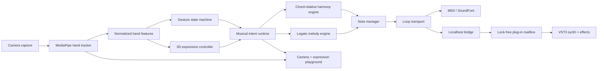

# System architecture



## Runtime boundaries

### Capture and tracking

`tracking` owns camera and MediaPipe integration. It converts vendor results into
`HandObservation`; downstream code never imports MediaPipe types. The live queue has capacity
one, so an overloaded tracker discards stale frames instead of increasing musical latency.

### Gesture and expression

`gestures.features` converts landmarks into normalized X/Y/Z, finger state, pinch distance,
confidence, and velocity. `gestures.state_machine` turns stable left-hand shapes into discrete
events with hold, cooldown, and release-to-rearm behavior.

The right hand is continuous:

- X selects a scale-locked melody lane.
- Motion speed drives vibrato.
- Y drives volume and expression.
- Z drives expression, brightness, and delay.
- Pinch re-articulates and increases reverb.

`ui.expression_playground` renders the same normalized state as a software 3D scene. Rendering
is diagnostic only and cannot block the music path.

### Musical intent and transport

`app.InstrumentRuntime` maps commands to musical intent. The musicality layer owns:

- seven style-specific pose chords;
- minimum-motion chord voicing;
- quality-aware, chord-relative lead scales;
- legato note hysteresis and deliberate re-articulation;
- independent chord latch and sustain pedal;
- per-hand tracking-loss behavior.

`music.transport.LoopTransport` captures bounded note and control events. It gives live and loop
notes separate ownership, so a loop note-off cannot cut off a note the performer is still
holding.

### Output and DAW integration

All outputs implement the same note/control contract:

- Mido for hardware or virtual MIDI;
- FluidSynth for standalone SoundFont audio;
- a fixed-size localhost packet bridge for the native VST3.

The companion sends 14-byte `SBW1` datagrams only to `127.0.0.1:18736`. The VST3 receives them
on a background socket thread and places validated commands into a bounded SPSC queue. The audio
thread drains that queue without socket calls, locks, memory allocation, Python, camera access,
or network access.

The VST3 also accepts ordinary DAW MIDI. It owns a native polyphonic synth, sustain behavior,
parameter smoothing, stereo reverb/delay/chorus, parameter state, and generated-MIDI output.
DAW transport synchronization and PPQ-quantized loop scenes are the next native transport slice;
the current companion loop is wall-clock based.

## State ownership

| State | Single owner |
|---|---|
| Camera frame freshness | camera/latest-frame queue |
| Pose stability and cooldown | gesture state machine |
| Active harmonic context | instrument runtime |
| Active notes and sustain | note manager |
| Live-vs-loop note references | loop transport |
| Plug-in voice and DSP state | VST3 audio processor |
| DAW tempo and playhead | host transport |

## Threading

```text
camera thread -> latest frame (capacity 1) -> tracker / intent worker
intent worker -> note manager -> loop transport -> selected output
VST bridge socket thread -> bounded SPSC mailbox -> DAW audio thread
UI thread <- immutable camera, expression, transport, and telemetry snapshots
```

## Latency budget

| Stage | Target |
|---|---:|
| Capture and conversion | 10 ms |
| Hand tracking | 35 ms |
| Features + gesture decision | 5 ms |
| Harmony / melody / expression | 5 ms |
| Output or bridge dispatch | 5 ms |
| Audio buffer and headroom | 40 ms |

The end-to-end target remains p95 under 100 ms on a supported laptop.

## Failure and safety rules

- Right-hand loss for 250 ms releases melody while retaining the left-hand chord.
- Both hands lost for 1500 ms, fist, panic, exception, and exit converge on all-notes-off.
- Output switching closes the previous sink and clears sustain.
- All queues and loop recordings are bounded.
- MIDI and bridge values are validated to `0..127`.
- The bridge binds only to loopback and its receiver never touches the DAW audio thread.
